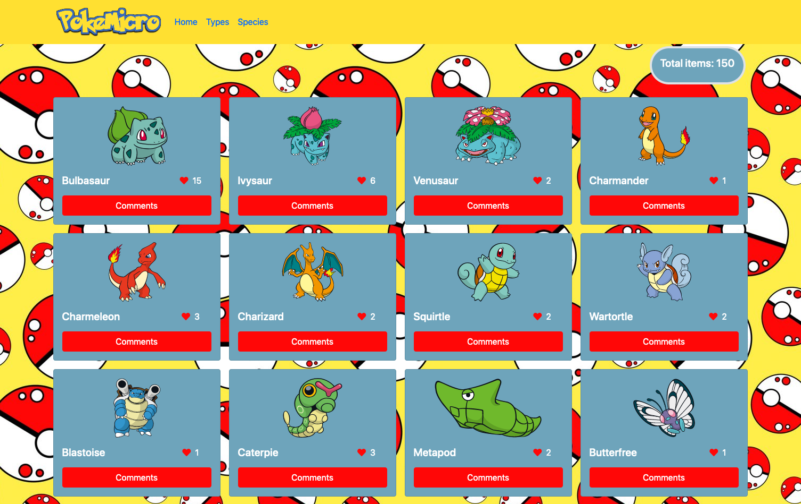

# javascript-capstone

> This capstone project is about consuming an API, in this case we used the PokeAPI. We hope you enjoy it!

## Built With

- HTML & CSS & JS & APIs & JEST & JSON & WEBPACK

## Demo

- [Online Demo](https://sevinchek.github.io/javascript-capstone/)

## Project Setup

- Clone this repository (use this SSH key git@github.com:sevinchek/javascript-capstone.git)
- Open the folder project (javascript-capstone)
- Install all dependencies with "npm install"
- Run the project with "npm start" and the project will load automatically in your default browser

## Authors

👤 **Kevin**

- GitHub: [@sevinchek](https://github.com/sevinchek)
- Twitter: [@sevinchek](https://twitter.com/sevinchek)
- LinkedIn: [LinkedIn](https://linkedin.com/in/sevinchek)

👤 **Eduardo Rodriguez**

- GitHub: [@EroAuditore](https://github.com/EroAuditore)
- Twitter: [@EroAuditore](https://twitter.com/EroAuditore)
- LinkedIn: [EroAuditore](https://www.linkedin.com/in/EroAuditore/)

## API Providers

- [PokeAPI](https://pokeapi.co/)
- [Microverse Involvement API](https://pokeapi.co/)

## 🤝 Contributing

Contributions, issues, and feature requests are welcome!

## Show your support

Give a ⭐️ if you like this project
